<h1 align="center">💡 <a href="https://lightson-460317.uc.r.appspot.com/">LightsOn</a></h1>

<p align="center">
  <a href="https://flask.palletsprojects.com/">
    
  </a>
  <a href="https://cloud.google.com/">
    
  </a>
  <a href="https://cloudflare.com/">
    
  </a>
  <a href="https://cloud.google.com/appengine">
    
  </a>
  <a href="https://fastapi.tiangolo.com/">
    
  </a>
  <a href="https://developer.mozilla.org/en-US/docs/Web/JavaScript">
    
  </a>
  <a href="https://developer.mozilla.org/en-US/docs/Web/HTML">
    
  </a>
  <br/>
  <p>LightsOn is a simple web app that lets you pick colors for your Philips Hue lights and view a live webcam snapshot, all in real time. The frontend is built with Python (Flask) + JavaScript, and the backend is a Python FastAPI service running on uvicorn inside Docker. Cloudflare Tunnel forwards requests from your public domain to your local machine.</p>
</p>


⸻

# Table of Contents
- [Features](#features)
- [Architecture](#architecture)
- [Prerequisites](#prerequisites)
- [Configuration and Deployment](#configuration-and-deployment)
- [Contributing](#contributing)

⸻

# Features
### 🔆 Pick any color via an interactive color wheel
### ⏱️ Color change commands are enqueued via Google Cloud Tasks
### 💡 Send color changes to your Philips Hue bridge via FastAPI
### 📸 View live webcam snapshots polled every 2 s
### ⚡ Fast, asynchronous backend with FastAPI & uvicorn
### 🐳 Containerized backend for easy deployment
#### 
#### Only able to edit the colors of hue and access a webcam locally to accomodate security. 
#### Thus the backend must be run locally.

⸻

# Architecture

```mermaid
flowchart TD
    A["User (Browser)"] 
    B["Flask Frontend<br>(App Engine)"]
    T["Cloud Tasks<br>Queue"]
    CFE["Cloudflare Edge →<br>Tunnel to Home Network"]
    F["FastAPI Backend<br>(uvicorn)"]
    H["Hue Light State"]
    O["OpenCV Camera Reader"]

    A -->|1a. Clicks 'Enter'| B
    B -->|2a. Enqueues '/set-color'| T
    B -->|2b. Requests '/camera/snapshot'| CFE

    T -->|3a. Dispatches task| CFE
    CFE -->|4a. POST '/set-color'| F
    CFE -->|4b. GET '/camera/snapshot'| F

    F -->|Updates Hue Bridge| H
    F -->|Returns JPEG Frame| O
```



⸻

# Prerequisites
	•	Python 3.9+
	•	Docker & Docker Compose (for backend)
	•	cloudflared (Cloudflare Tunnel)
	•	Google Cloud SDK (for Cloud Tasks & App Engine)
	•	A Philips Hue Bridge on your LAN
	•	A webcam at /dev/videoX (or another device)

⸻

# Configuration and Deployment

### Create a .env file in backend/ with:

``` bash
WEBCAM=                     /dev/videoN-(N-is-index-for-OpenCV-default-is-0)
HUE_BRIDGE_IP=              steps-below
HUE_USERNAME=               steps-below
HUE_LIGHT_IDS=              steps-below
SERVICE_URL=                cloudflare-dns
TASK_SERVICE_ACCOUNT_EMAIL= your-service-account-email-for-gcp-queue
```

In LightsOn/main.py, set (skip if creating later) your Google Cloud project:

export GOOGLE_CLOUD_PROJECT=<your-project-id>

____

### Getting your Hue light IDs, Bridge IP, and Username

1. Get your Hue Bridge IP
```
curl https://discovery.meethue.com
```

2. Get or create a Hue API Username (need to press the button on top of the Hue Bridge)
```
curl -X POST -d '{"devicetype":"my_script#terminal"}' http://192.168.1.42/api
```

3. Get the list of lights
```
curl http://<BRIDGE_IP>/api/<USERNAME>/lights | jq
```

Optional Shell Script:
```
BRIDGE_IP="192.168.X.X"
USERNAME="your-bridge-username"

curl -s http://$BRIDGE_IP/api/$USERNAME/lights | jq 'to_entries[] | "\(.key): \(.value.name)"'
```
Returns something like this:
```
"1: Living Room Lamp"
"2: Kitchen Light"
```

⸻


### Build & run backend w Docker Compose
```
docker-compose up --build
```

### Stand up cloudflared and the following command after creating a tunnel [[GUIDE]](https://developers.cloudflare.com/cloudflare-one/connections/connect-networks/get-started/)

Run the tunnel with
```
cloudflared tunnel --loglevel debug --config ~/.cloudflared/config.yml run <tunnel-id>
```

Create file like cloudflared/config.yml
```
tunnel: XXXXXXXX-XXXX-XXXX-XXXX-XXXXXXXXXXXX
credentials-file: ~/.cloudflared/XXXXXXXX-XXXX-XXXX-XXXX-XXXXXXXXXXXX.json
ingress:
  - hostname: zwingerbackend.com
    path: /camera/snapshot
    service: http://localhost:8080
  - hostname: zwingerbackend.com
    path: /set-color
    service: http://localhost:8080
  - hostname: zwingerbackend.com
    path: /health
    service: http://localhost:8080
  - service: http_status:404
originRequest:
  keepAliveTimeout: 35s
  tcpKeepAlive: 60s
no-quic: true
protocol: http2
```

### Get running with Google App Engine
Create project
```
gcloud projects create YOUR_PROJECT_ID --name="Your Project Name"
gcloud config set project YOUR_PROJECT_ID
```

Enabled App Engine in desired region as well as Task Queue API
```
gcloud app create --region=us-central
gcloud services enable cloudtasks.googleapis.com
```

Create Task Queue
```
gcloud tasks queues create color-changes \
  --max-dispatches-per-second=0.5 \
  --max-concurrent-dispatches=1 \
  --location=us-central1
```

Deploy and view
```
gcloud app deploy
gcloud app browse
```


⸻

# Contributing

###	1.	Fork it
###	2.	Create a feature branch
###	3.	Submit a pull request
### 4.  Leave a Star

Please open an issue first if you’re planning a major change.